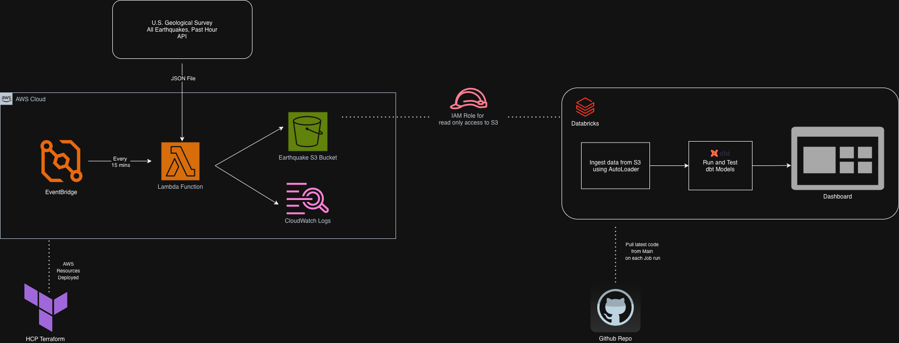

# Earthquake Pipeline

A serverless ELT pipeline implementing a Medallion Architecture for USGS seismic data, with a Databricks dashboard for near real time visualization.

## AWS Architecture

> AWS, whose resources are provisioned by Terraform, handles the ingestion layer. 

### EventBridge
Triggers the Lambda function on a scheduled rule every 15 minutes.

### Lambda
Fetches earthquake events from the past hour from the USGS API and writes raw JSON files to S3.

### S3
Acts as the landing zone for raw JSON files and the bridge between AWS and Databricks. Databricks Auto Loader monitors the S3 bucket and picks up new files as they arrive.

### CloudWatch
Captures Lambda logs for monitoring and debugging ingestion failures

## Databricks Orchestration

> The pipeline is orchestrated as a Databricks Job set up to trigger on every file arrival in the S3 bucket. 

The job is configured to pull the latest code directly from the `main` branch of this repository on every run, ensuring the pipeline always reflects the most recent changes without manual intervention. Email alerts are sent on failure at any step.

### Auto Loader (Bronze Ingestion)
Monitors the S3 landing zone for new JSON files and incrementally ingests them into the bronze Unity Catalog table, processing only new files since the last run

### dbt Models
Runs staging, intermediate, and fact table transformations in dependency order. dbt tests run alongside transformations to catch data quality issues before they reach the dashboard. A model is built then tested; in case of data quality test failures, the downstream models are not run and the task is shown as a "failure".

### Dashboard Refresh
Triggers a refresh of the Databricks dashboard so visualizations reflect the latest data

## dbt Models Overview

> This project uses dbt to test, document, and create SQL transformation models

These models power a Databricks dashboard that updates every ~20 minutes and visualizes earthquake activity, trends, and geographic patterns.

### Source / Bronze Table
Raw earthquake data from the S3 bucket is flattened and stored in a bronze table for downstream use.

### Staging (View) 
Performs initial cleaning and standardization, including type casting, timestamp normalization, and column selection and renaming to create a consistent schema.

### Intermediate (Incremental)
Deduplicates earthquake events using unique identifiers. Implemented as an incremental model to efficiently handle late arriving or updated records without reprocessing the full dataset.

### Fact Tables (Table) 
Built for analytical use in the final Databricks dashboard:

#### **fct_earthquakes_daily**: 
Summarizes daily earthquake counts, magnitude statistics, depth distribution, and tsunami warnings

#### **fct_earthquakes_rolling_7d**:
Shows current day's total earthquake count and a rolling average count from the past 7 days

#### **fct_earthquakes_by_region_30d**: 
Identifies the most active geographic regions from the past 30 days

